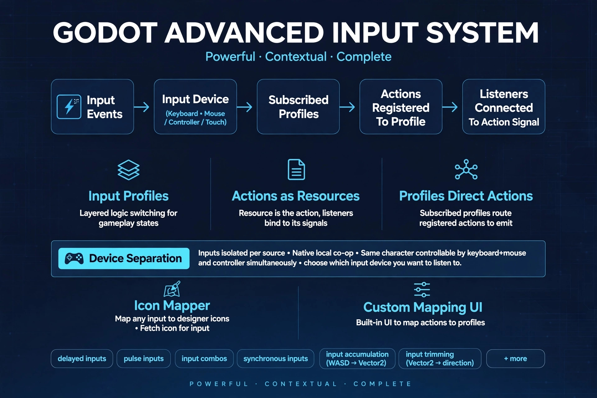

# Godot Advanced Input System (GAIS)



> **Version:** `v0.1.0`  
> **Godot Compatibility:** Godot 4.3+  
> **Language:** GDScript (C# is currently not supported)

> **Disclaimer:** All prompt icons and controller artwork used in the `demo/` folder are from [Kenney Input Prompts](https://kenney.nl/assets/input-prompts). I do not hold any rights over their creation or distribution.

---

## Disclosure

1. The promotional poster for this addon was generated with the help of an AI image generator.
2. Generative AI was used in the development of this plugin as an assistant for bug cleaning, code clean-up, and brainstorming. The core architecture was still devised and constructed by me.
3. The demo for this plugin was haphazardly constructed just to demonstrate the capabilities of this plugin. It should not be considered an ideal example of structuring or coding techniques, and it may contain some bugs.

---

## Overview

Godot Advanced Input System is not something I built out of necessity as there are already a few input systems available on the Asset Store. Instead, it was a personal challenge project. I wanted to try building something that could easily handle things that are hard to construct and manage with Godot's native input system—especially once a project grows beyond a simple single-character, single-input source setup.

This system doesn't offer a ton of brand-new features compared to other addons, but it was my attempt to make handling input simpler, easier to scale, and give it more of a natural "Godot feel". While I won't claim it is completely unique compared to Unreal's or Unity's input systems, it tries to bring those concepts closer to "The Godot Way."

All the components here are made to be easy to understand and extend. You can easily create your own custom variants for modifiers or triggers (which are called **Proxies** in this system). I also documented all the scripts directly in code to the best of my ability, so you can check them inside the editor if anything is confusing.

---

## Key Features

* **Input Source & Device Separation:** Separates physical devices from the player. This makes local co-op much easier to set up, while also letting a single character use multiple input devices at the same time (like using keyboard/mouse and a controller together).
* **Broad Device Support:** Works with most common input sources: Keyboard, Mouse, Gamepad/Controller, and Touchscreen *(does not support Gyroscope, MIDI, InputAction or Shortcut events)*.
* **Completely InputMap Independent:** Bypasses Godot's static `InputMap` strings completely and links directly to hardware input events.
* **Context Switching (Push & Pop):** Push and pop input contexts on demand to handle different gameplay scenarios (like opening an inventory, driving a vehicle, or riding a mount) where each situation needs its own input scheme.
* **Input Prioritization:** Makes input flow between multiple actions much more flexible, even between different active contexts.
* **Input State Machines:** Actions don't just output plain vectors, floats, or booleans. Every action gives you the full context and state through a state machine (`STARTED` -> `PROCESSING` -> `ENDED`), along with handy info like the sender action, triggering raw events, and elapsed duration and a bit more.
* **Input Modification (Proxies):** This is pretty much like "Triggers" in Unreal, but handled a bit differently. Here, they are called Input Proxies and are set up as individual resources that you can easily extend to make your own. The plugin comes with the most common ones and a few extras, plus base templates and documentation charts showing what each proxy can do.
* **Input Accumulation & Directional Trimming:** Easily combine multiple button presses into a single vector (like turning WASD into a `Vector2`), or trim continuous motion into a single direction (like isolating just "Mouse Motion Up").
* **Runtime Rebinding:** Change or rebind any input at any time while the game is running (essential for settings menus).
* **Custom Input-to-Icon Mapper:** Comes with an input-to-icon mapping resource to make setting up button prompts and rebinding menus a lot easier.

---

## Installation

1. Download or clone this repository.
2. Copy the `addons/GodotAdvancedInputSystem` folder directly into your project's `res://addons/` directory.
3. In the Godot editor, go to **Project -> Project Settings -> Plugins**.
4. Enable **Godot Advanced Input System**.

---

## Quick Example

### Managing Contexts
```gdscript
# Push a menu or vehicle context onto the stack
func _on_enter_vehicle() -> void:
	InputManager.push_profile(vehicle_context)

# Restore previous controls
func _on_exit_vehicle() -> void:
	InputManager.pop_profile()
```

### Consuming State-Driven Actions
```gdscript
func _on_jump_action(context: InputContext) -> void:
	match context.execution_state:
		InputContext.STARTED:
			player.start_jump()
		InputContext.PROCESSING:
			player.hold_jump(context.elapsed_duration)
		InputContext.ENDED:
			player.release_jump()
```

---

## Documentation

Full documentation is available [here](https://RiOnE03.github.io/GodotAdvancedInputSystem/)

---

## License

Distributed under the MIT License. See [`LICENSE`](LICENSE) for details.